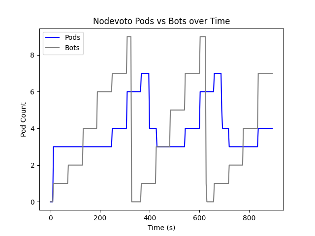
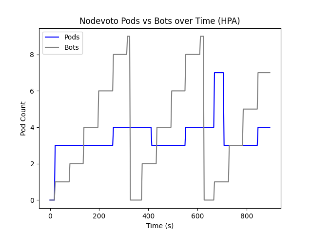

# Linkerd Scaler

## About
Linkerd Scaler collects metrics from the Kubernetes metrics server and Linkerd proxy prometheus metrics server. An HPA style scaling algorithm can be used to scale pods.

## Usage
Start by running:
```
./start.sh
```

Keep this script running for as long as you want the cluster alive, `^C` to exit.

With the cluster running, in another terminal, `kubectl` and other commands can be executed on the cluster.

Outputs of the watcher are found in `metrics/`, these persist but are deleted on each new watcher start.

Run settings are found at the top of `watcher/main.py`. To configure Kubernetes HPA either comment out or run the `nodevoto-hpa.yaml` line in `start.sh`. Kubernetes HPA and the `ACTIVE` setting in `main.py` should not both be enabled.

## Samples


Poll period of 3 seconds, ran for 15 minutes. HPA has stabilization window of 0 seconds.

## Nodevoto
Nodevoto can be found [here](https://github.com/sourishkrout/nodevoto).

